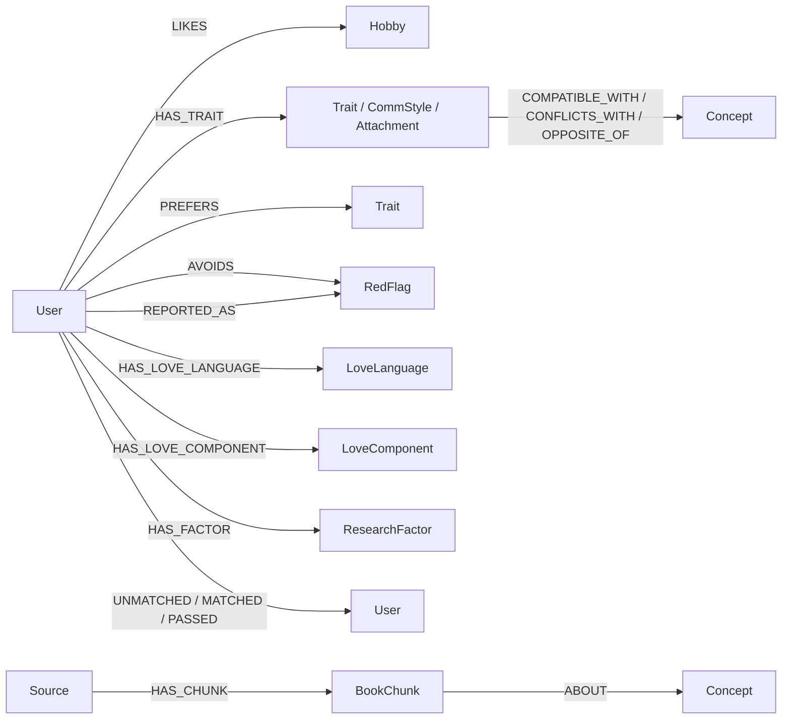

# Graph — PSU Dealing

ส่วน Knowledge Graph ของโปรเจกต์ บน branch `dev/graph` ใช้ข้อมูลที่เตรียมแล้วใน `data/` สร้างโหนด ความสัมพันธ์ และหลักฐานที่ย้อนตรวจได้

**ขอบเขตตอนนี้เป็น Graph เท่านั้น:** ไม่มี embeddings, vector search, matcher, ranking, Hybrid RAG, LLM หรือ LINE integration

## ตรวจข้อมูลก่อนนำเข้า

จาก root ของ repository:

```bash
python3 -m graph.build
```

คำสั่งนี้สร้างกราฟในหน่วยความจำ ตรวจโครงสร้าง แล้วแสดงรายงานใน terminal โดยไม่สร้างไฟล์ผลลัพธ์ การนำเข้าฐานข้อมูลใช้ `python3 -m graph.import_neo4j` ซึ่งอ่านข้อมูลจาก `data/` โดยตรง จึงไม่ต้องรัน build ก่อนทุกครั้ง

ผลจากข้อมูลปัจจุบัน: **406 nodes / 6,619 relationships** ประกอบด้วยผู้ใช้ 300 คน แนวคิด 61 รายการ เอกสารที่มี chunks แล้ว 1 แหล่ง และ 44 chunks

## โครงสร้างกราฟ



`Concept` เป็น label ร่วมของ Hobby, Trait, CommStyle, Attachment, LoveLanguage, LoveComponent, RedFlag และ ResearchFactor ไม่สร้างรหัสแนวคิดใหม่เอง ใช้ taxonomy เดิมครบทั้ง 61 รหัส

| ข้อมูล | สิ่งที่เก็บ |
|---|---|
| User | รหัสเดิม เช่น `U001`, ชื่อจำลอง, อายุ, เพศ, seeking, faculty/campus, lifestyle, age_range, consent |
| Persona edges | confidence, evidence_count, last_seen ตามที่ต้นฉบับมี พร้อมตำแหน่ง field ต้นทาง |
| PREFERS / AVOIDS | weight, count และ source ตามที่มีในโปรไฟล์ |
| REPORTED_AS | เฉพาะ `usable == true` และ `report_count >= 3`; assertion ว่าเป็นรายงานที่ยังไม่ยืนยัน |
| Event edges | event_id, timestamp, ทิศทางจากผู้แจ้งไปยังอีกฝ่าย; หลาย event ระหว่างคู่เดิมคงอยู่แยกกัน |
| Compatibility rules | weight, reason, source ตาม taxonomy และ `symmetric: true`; บันทึกเส้นครั้งเดียว |
| Source / BookChunk | source_id, chunk_id, chapter, section, pages, category, topics และข้อความต้นฉบับของ chunk |
| ABOUT | จำนวนการพบคำและเลขหน้า; ระบุว่าเป็น keyword tag |

Life satisfaction และองค์ประกอบความรักเก็บ `value` บนเส้น ค่า lifestyle เก็บเป็น properties ของ User เพื่อไม่เพิ่ม taxonomy โดยพลการ

## กติกาคุณภาพข้อมูล

1. อ่าน input เพียง `taxonomy.json`, `mock/users.json`, `mock/events.jsonl`, `processed/book_chunks.jsonl` ไม่อ่าน `ground_truth_pairs.json` หรือ chats
2. ใช้ property allowlist: ไม่ส่ง `_ground_truth_flags`, `_archetype`, `gold_extracted` หรือข้อความเหตุผลจาก event เข้า graph
3. เก็บรายงานพฤติกรรมเฉพาะ usable และจำนวนถึงเกณฑ์ แต่ไม่ได้รับรองว่าเป็นข้อเท็จจริง และใช้ยอดรวมจากโปรไฟล์ ไม่ได้ตรวจผู้รายงานอิสระซ้ำ
4. เก็บ consent ของผู้ใช้จำลองทุกคนไว้ให้ตรวจสอบ การสำรวจกราฟนี้ไม่ใช่รายการแนะนำคู่ หากต่อ matcher ภายหลังต้องกรอง consent และข้อจำกัดทั้งสองฝ่าย
5. ทุก compatibility rule เป็น `unverified_taxonomy_rule` ยังไม่ได้ตรวจยืนยันกับเอกสารต้นฉบับ กฎที่ไม่มี source จะไม่มีการแต่ง source เพิ่ม
6. `ABOUT` เป็น `keyword_tag_not_entailment` ไม่ใช่หลักฐานว่าบทความรับรองกฎความเข้ากันได้ ห้ามใช้การมี tag เพื่อสร้างเส้น `SUPPORTED_BY` อัตโนมัติ
7. ถ้าไม่มี chunk ของแนวคิด เช่น `rf:stonewalling` คำสั่งสำรวจจะได้รายการว่าง ส่วน `concepts_without_chunks` จะแจ้งช่องว่างนี้ไว้
8. ตรวจ ID ซ้ำ, endpoint ที่ไม่มีจริง, domain/range, property types, confidence/weight และ hash ก่อนนำเข้า ข้อมูลผิดทำให้หยุด ไม่ข้ามทิ้งเงียบ ๆ

`users.json` ปัจจุบันผ่านการสร้างฟีดแบ็กจาก gold labels ใน mock pipeline มาแล้ว กราฟนี้จึงเป็นการจำลองบน prepared profiles ยังไม่ใช่การพิสูจน์ความแม่นยำของ extractor หรือผลจากผู้ใช้จริง

## ใช้ Neo4j

ติดตั้ง driver ใน virtual environment จาก root:

```bash
python3 -m venv .venv
.venv/bin/pip install -r graph/requirements.txt
```

สำหรับเครื่องที่เปิด Docker อยู่ ให้คัดลอก `graph/.env.example` เป็น `graph/.env` แล้วเปลี่ยนรหัสผ่านก่อนเริ่ม ใช้ไฟล์เดิมได้ถ้ามีการตั้งค่าไว้แล้ว:

```bash
docker compose -f graph/compose.yaml up -d
```

compose แยกชื่อโปรเจกต์และ volumes เป็น `psu-dealing-graph` ใช้ localhost ports **17474 (Browser) / 17687 (Bolt)** เพื่อแยกจากงาน lab ที่พอร์ตมาตรฐาน ต้องไม่มี Neo4j ตัวอื่นใช้สองพอร์ตนี้อยู่

โหลด environment แล้วนำเข้า:

```bash
set -a
. graph/.env
set +a
.venv/bin/python -m graph.import_neo4j
.venv/bin/python -m graph.explore summary
```

Python อ่าน environment variables โดยตรง ไม่ได้โหลด `.env` อัตโนมัติ หากใช้ Neo4j ที่มีอยู่แล้ว ให้ตั้ง `NEO4J_URI`, `NEO4J_USERNAME`, `NEO4J_PASSWORD`, `NEO4J_DATABASE` ให้ตรงกับเครื่องนั้น

เปิด Neo4j Browser ที่ <http://localhost:17474/browser/> แล้วใช้คำสั่งใน `queries.cypher`

### นำเข้าซ้ำและเปลี่ยนข้อมูล

- ใช้ `MERGE`, unique constraints และ transaction ตาม [Neo4j Python driver documentation](https://neo4j.com/docs/python-manual/current/transactions/)
- ทุกโหนดมี label `DealingEntity` และ key ที่ประกอบด้วย dataset + snapshot + id ไม่รวมกับกราฟจากงานอื่น
- snapshot เป็น SHA-256 ของข้อมูลกราฟที่เรียงลำดับแล้ว นำเข้าข้อมูลเดิมซ้ำไม่เพิ่มโหนดหรือเส้น
- ข้อมูลเปลี่ยนจะสร้าง snapshot ใหม่ แล้วเปลี่ยน `DealingDataset.active_snapshot` เมื่อทั้งชุดผ่านการตรวจใน transaction เดียว คำสั่ง explore จึงไม่เห็นรายงานหรือความสัมพันธ์เก่าที่ถูกถอดออก
- snapshot เก่ายังคงอยู่เพื่อ audit ไม่มีคำสั่งล้างฐานข้อมูล การ query ใน Browser ต้องกรอง `active_snapshot` ตามตัวอย่าง หาก query ทุก `User` โดยไม่กรองจะเห็นข้อมูลทุกเวอร์ชัน
- นี่เป็นการ import prepared snapshot ไม่ใช่ service อัปเดตแชทแบบ realtime และยังไม่มีระบบลบข้อมูลเก่าตาม lifecycle

## สำรวจข้อมูลโดยไม่ทำ RAG

```bash
.venv/bin/python -m graph.explore profile --user-id U001
.venv/bin/python -m graph.explore events --user-id U001
.venv/bin/python -m graph.explore shared --user-id U001 --other-id U002
.venv/bin/python -m graph.explore rules
.venv/bin/python -m graph.explore rule-paths --user-id U001 --other-id U002
.venv/bin/python -m graph.explore reports
.venv/bin/python -m graph.explore chunks --concept-id attach:secure
```

`shared` กับ `rule-paths` ใช้ผู้ใช้สองคนที่ระบุเพื่อสำรวจเส้นทางเท่านั้น ไม่หาผู้สมัคร ไม่คิดคะแนน ไม่เรียงอันดับคู่ ผลลัพธ์เป็นข้อมูล JSON ที่ตรวจสอบได้

## ไฟล์และการส่งต่อ

```text
graph/
  schema.py          ประเภทโหนด / ความสัมพันธ์ / domain และ range
  model.py           รูปแบบกราฟ, ID, hash, validation
  build.py           แปลงข้อมูลในหน่วยความจำและตรวจโครงสร้าง
  neo4j_store.py      นำเข้าแบบ snapshot และเชื่อมต่อฐานข้อมูล
  import_neo4j.py     CLI นำเข้า
  queries.py         Cypher สำรวจกราฟ
  explore.py         CLI สำรวจ
  queries.cypher     ตัวอย่างสำหรับ Neo4j Browser
  compose.yaml       Neo4j แยกสำหรับโปรเจกต์
  tests/             ตรวจข้อมูลและ integration กับ Neo4j
```

เก็บ ID ของ user/concept/chunk เดิมไว้บนโหนดใน Neo4j ให้เพื่อนเชื่อมข้อมูลภายหลังได้ ไม่ต้องมีไฟล์กราฟตัวกลาง

## ดูกราฟและ export จาก Neo4j

1. เปิด Neo4j Browser และรันทีละ block ใน `queries.cypher` ซึ่งกรองเฉพาะ active snapshot
2. เลือก Graph view เพื่อจัดตำแหน่งโหนดและตรวจความสัมพันธ์จริงในฐานข้อมูล
3. ใช้ปุ่ม Download/Export ของกรอบผลลัพธ์เพื่อบันทึกภาพ PNG (บางรุ่นรองรับ SVG ด้วย)
4. หากต้องการข้อมูล เลือก Table view แล้ว export CSV หรือ JSON จากผล query

รายละเอียดเมนูตามรุ่นดู [Neo4j Browser result frames](https://neo4j.com/docs/browser/operations/result-frames/) การ export จะครอบคลุมผล query ที่แสดงเท่านั้น ตัวอย่างที่มี LIMIT ไม่ใช่การ export กราฟทั้งหมด

สำหรับ export ข้อมูลครบ active snapshot ให้ใช้สองคำสั่งท้าย `queries.cypher` ซึ่งไม่มี LIMIT และตรวจจำนวนแถวก่อนดาวน์โหลด: nodes 406 แถว และ relationships 6,619 แถวตามชุดปัจจุบัน ปรับ record limit ของ Browser หากตั้งไว้น้อยกว่านี้

ไฟล์ SVG และ PNG ที่ export จาก Neo4j Browser สำหรับ snapshot ปัจจุบันอยู่ใน [`exports/`](exports/):

- `00_full_graph` — ภาพรวมทั้งหมด: 406 nodes, 6,619 relationships
- `01_user_profile` — ความเชื่อมโยงของผู้ใช้ `U001`
- `02_concept_rules` — กฎความสัมพันธ์ระหว่างแนวคิด 14 เส้น
- `03_knowledge_sources` — chunks และแนวคิดจากคำสั่งตัวอย่างที่จำกัด `LIMIT 100` จึงเป็นภาพบางส่วนของคลังเอกสาร

แต่ละมุมมองมีไฟล์ SVG และ PNG ที่ Neo4j Browser export ให้โดยตรง ภาพรวมทั้งหมดจะแน่นและอ่านรายละเอียดได้ยากเพราะแสดงทุกเส้นพร้อมกัน ใช้มุมมองแยกด้านล่างเมื่อต้องการดูรายละเอียด ภาพ PNG มีพื้นหลังโปร่งใส

## ทดสอบ

```bash
python3 -m unittest discover -s graph/tests -v
```

การทดสอบนี้ไม่ต้องเปิด Neo4j และจะ skip live integration 3 tests หากต้องการทดสอบนำเข้าจริง ให้นำ environment ของฐานข้อมูลโปรเจกต์หรือฐานทดลองมาใช้ก่อน:

```bash
GRAPH_NEO4J_TEST=1 .venv/bin/python -m unittest discover -s graph/tests -v
```

Integration tests นำเข้าข้อมูลจริงซ้ำ ตรวจทุก query และทดลองเปลี่ยน consent/ถอด reported trait แล้วคืน active snapshot เป็นข้อมูลชุดปัจจุบัน เก็บ snapshot ทดลองไว้เพื่อไม่ลบข้อมูลใด ๆ

## แนวทางที่อ่านจาก AjKrit

- `Neo4j/Graph Database Setup with Neo4j and Docker/compose.yaml`: แยกบริการและใช้ environment ตั้ง authentication
- `Graph RAG/6610110554_LAB1-4From Graph Database to Graph RAG.md`: แยก Node, Relationship, Property; ออกแบบ domain/range และใช้ MATCH สำรวจเส้นทาง
- `How to PDF_BERTSBERT_LLM_Ontology_Neo4j/neo4j_best_graph/import_neo4j.py`: grouped MERGE, scoped labels, constraints และตรวจจำนวนหลังนำเข้า
- `How to PDF_BERTSBERT_LLM_Ontology_Neo4j/neo4j_best_graph/README.md`: เก็บที่มาและแยกสิ่งที่เอกสารรายงานออกจากข้อสรุปที่ยังไม่ตรวจสอบ

นำแนวคิดมาปรับกับข้อมูลโปรเจกต์นี้ ไม่ได้แก้ไฟล์ใน AjKrit หรือคัดลอก credentials จากงานเดิม
