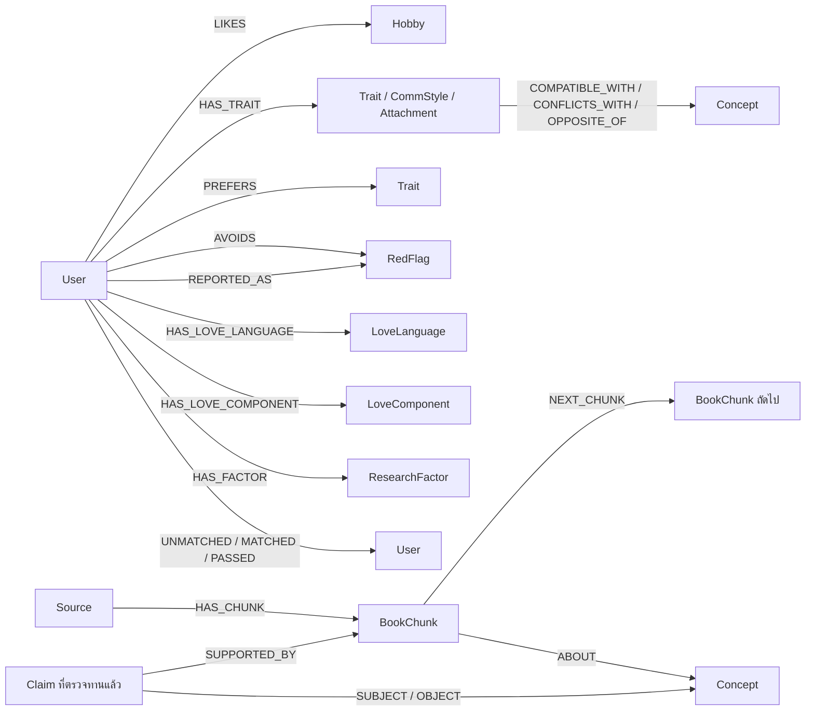

# Graph — PSU Dealing

ส่วน Knowledge Graph ของโปรเจกต์ ใช้ข้อมูลที่เตรียมแล้วใน `data/` สร้างโหนด ความสัมพันธ์ และหลักฐานที่ย้อนตรวจได้

Graph ใช้ร่วมกับ Dense/Hybrid RAG ของแอป: คืน chunk ต้นฉบับและเส้นทางหลักฐานให้ตัวตอบคำถาม ส่วนกฎ taxonomy ใช้กับ matcher แยกจากหลักฐานเอกสาร

## ตรวจข้อมูลก่อนนำเข้า

จาก root ของ repository:

```bash
python3 -m graph.build
```

คำสั่งนี้สร้างกราฟในหน่วยความจำ ตรวจโครงสร้าง แล้วแสดงรายงานใน terminal โดยไม่สร้างไฟล์ผลลัพธ์ การนำเข้าฐานข้อมูลใช้ `python3 -m graph.import_neo4j` ซึ่งอ่านข้อมูลจาก `data/` โดยตรง จึงไม่ต้องรัน build ก่อนทุกครั้ง

ผลจากข้อมูลปัจจุบัน (ไม่มี Claim ที่เปิดใช้): **1,459 nodes / 8,291 relationships** ประกอบด้วยผู้ใช้ 300 คน เอกสาร 37 แหล่ง, 1,053 chunks และ `NEXT_CHUNK` 707 เส้น

## โครงสร้างกราฟ


```mermaid
graph LR
  U[User] -->|LIKES| H[Hobby]
  U -->|HAS_TRAIT| T[Trait / CommStyle / Attachment]
  U -->|PREFERS| P[Trait]
  U -->|AVOIDS| R[RedFlag]
  U -->|REPORTED_AS| R
  U -->|HAS_LOVE_LANGUAGE| L[LoveLanguage]
  U -->|HAS_LOVE_COMPONENT| C[LoveComponent]
  U -->|HAS_FACTOR| F[ResearchFactor]
  U -->|UNMATCHED / MATCHED / PASSED| V[User]
  T -->|COMPATIBLE_WITH / CONFLICTS_WITH / OPPOSITE_OF| T2[Concept]
  S[Source] -->|HAS_CHUNK| B[BookChunk]
  B -->|NEXT_CHUNK| B2[BookChunk ถัดไป]
  B -->|ABOUT| K[Concept]
  Q[Claim ที่ตรวจทานแล้ว] -->|SUBJECT / OBJECT| K
  Q -->|SUPPORTED_BY| B
```

`Concept` เป็น label ร่วมของ Hobby, Trait, CommStyle, Attachment, LoveLanguage, LoveComponent, RedFlag และ ResearchFactor ไม่สร้างรหัสแนวคิดใหม่เอง ใช้ taxonomy เดิมครบทั้ง 61 รหัส

| ข้อมูล | สิ่งที่เก็บ |
|---|---|
| User | รหัสเดิม เช่น `U001`, ชื่อจำลอง, อายุ, เพศ, seeking, faculty/campus, lifestyle, age_range, consent |
| Persona edges | confidence, evidence_count, last_seen ตามที่ต้นฉบับมี พร้อมตำแหน่ง field ต้นทาง |
| PREFERS / AVOIDS | weight, count และ source ตามที่มีในโปรไฟล์ |
| REPORTED_AS | เฉพาะ `usable == true` และ `report_count >= 3`; assertion ว่าเป็นรายงานที่ยังไม่ยืนยัน |
| Event edges | event_id, timestamp, ทิศทางจากผู้แจ้งไปยังอีกฝ่าย; หลาย event ระหว่างคู่เดิมคงอยู่แยกกัน |
| Compatibility rules | weight, reason, source ตาม taxonomy และ `symmetric: true`; บันทึกเส้นครั้งเดียว |
| Source / BookChunk | source_id, chunk_id, chapter, section, pages, category, topics และข้อความต้นฉบับของ chunk |
| ABOUT | จำนวนการพบคำและเลขหน้า; ระบุว่าเป็น keyword tag |
| NEXT_CHUNK | ลำดับ chunk ติดกันภายในแหล่งและ section เดียวกัน; ใช้ขยายบริบท ไม่ใช่ข้อสรุปเชิงเหตุผล |
| Claim / SUPPORTED_BY | ข้อกล่าวอ้างเชิงโครงสร้างและ chunk ต้นฉบับ; จะคืนเป็น graph fact เมื่อมีการตรวจทานจริงเท่านั้น |

Life satisfaction และองค์ประกอบความรักเก็บ `value` บนเส้น ค่า lifestyle เก็บเป็น properties ของ User เพื่อไม่เพิ่ม taxonomy โดยพลการ

## กติกาคุณภาพข้อมูล

1. อ่าน input เพียง `taxonomy.json`, `mock/users.json`, `mock/events.jsonl`, `processed/book_chunks.jsonl` ไม่อ่าน `ground_truth_pairs.json` หรือ chats
2. ใช้ property allowlist: ไม่ส่ง `_ground_truth_flags`, `_archetype`, `gold_extracted` หรือข้อความเหตุผลจาก event เข้า graph
3. เก็บรายงานพฤติกรรมเฉพาะ usable และจำนวนถึงเกณฑ์ แต่ไม่ได้รับรองว่าเป็นข้อเท็จจริง และใช้ยอดรวมจากโปรไฟล์ ไม่ได้ตรวจผู้รายงานอิสระซ้ำ
4. เก็บ consent ของผู้ใช้จำลองทุกคนไว้ให้ตรวจสอบ การสำรวจกราฟนี้ไม่ใช่รายการแนะนำคู่ หากต่อ matcher ภายหลังต้องกรอง consent และข้อจำกัดทั้งสองฝ่าย
5. ทุก compatibility rule เป็น `unverified_taxonomy_rule` ยังไม่ได้ตรวจยืนยันกับเอกสารต้นฉบับ กฎที่ไม่มี source จะไม่มีการแต่ง source เพิ่ม
6. `ABOUT` เป็น `keyword_tag_not_entailment` ไม่ใช่หลักฐานว่าบทความรับรองกฎความเข้ากันได้ ห้ามใช้การมี tag เพื่อสร้างเส้น `SUPPORTED_BY` อัตโนมัติ
7. ถ้าไม่มี chunk ของแนวคิด เช่น `rf:stonewalling` คำสั่งสำรวจจะได้รายการว่าง ส่วน `concepts_without_chunks` จะแจ้งช่องว่างนี้ไว้
8. ตรวจ ID ซ้ำ, endpoint ที่ไม่มีจริง, domain/range, property types, confidence/weight และ hash ก่อนนำเข้า ข้อมูลผิดทำให้หยุด ไม่ข้ามทิ้งเงียบ ๆ

`users.json` ปัจจุบันผ่านการสร้างฟีดแบ็กจาก gold labels ใน mock pipeline มาแล้ว กราฟนี้จึงเป็นการจำลองบน prepared profiles ยังไม่ใช่การพิสูจน์ความแม่นยำของ extractor หรือผลจากผู้ใช้จริง

## ใช้ Neo4j

ติดตั้ง driver ใน virtual environment จาก root:

```bash
python3 -m venv .venv
.venv/bin/pip install -r graph/requirements.txt
```

สำหรับเครื่องที่เปิด Docker อยู่ ให้คัดลอก `graph/.env.example` เป็น `graph/.env` แล้วเปลี่ยนรหัสผ่านก่อนเริ่ม ใช้ไฟล์เดิมได้ถ้ามีการตั้งค่าไว้แล้ว:

```bash
docker compose -f graph/compose.yaml up -d
```

compose แยกชื่อโปรเจกต์และ volumes เป็น `psu-dealing-graph` ใช้ localhost ports **7474 (Browser) / 7687 (Bolt)** ซึ่งเป็นพอร์ตมาตรฐานของ Neo4j ต้องไม่มี Neo4j ตัวอื่นใช้สองพอร์ตนี้อยู่

โหลด environment แล้วนำเข้า:

```bash
set -a
. graph/.env
set +a
.venv/bin/python -m graph.import_neo4j
.venv/bin/python -m graph.explore summary
```

Python อ่าน environment variables โดยตรง ไม่ได้โหลด `.env` อัตโนมัติ หากใช้ Neo4j ที่มีอยู่แล้ว ให้ตั้ง `NEO4J_URI`, `NEO4J_USERNAME`, `NEO4J_PASSWORD`, `NEO4J_DATABASE` ให้ตรงกับเครื่องนั้น

เปิด Neo4j Browser ที่ <http://localhost:7474/browser/> แล้วใช้คำสั่งใน `queries.cypher`

สีและชื่อโหนด: รัน `:style` แล้วกด **Upload GraSS styles** เลือก [`browser.grass`](browser.grass) และกด **Import** สไตล์แยกสีตามประเภท เช่น User สีฟ้า, Hobby สีส้ม, Trait สีม่วง และ RedFlag สีแดง พร้อมใช้ `display_name` เป็นข้อความบนโหนด การตั้งค่านี้เก็บใน Browser จึงต้องนำเข้าอีกครั้งเมื่อเปลี่ยน browser/profile

ทดสอบกับ Neo4j Browser 2026.08.24: ตัวนำเข้าให้กฎที่อยู่ท้ายไฟล์มีลำดับความสำคัญสูงกว่า จึงวาง `DealingEntity` และ `Concept` ก่อนประเภทเฉพาะ หากใช้ Browser รุ่นอื่น ให้ตรวจ **Results overview → Update styling priority** และย้ายสอง label กลางนี้ไปท้ายรายการ เพื่อไม่ให้ทุกโหนดใช้สีเดียวกัน


### นำเข้าซ้ำและเปลี่ยนข้อมูล

- ใช้ `MERGE`, unique constraints และ transaction ตาม [Neo4j Python driver documentation](https://neo4j.com/docs/python-manual/current/transactions/)
- ทุกโหนดมี label `DealingEntity` และ key ที่ประกอบด้วย dataset + snapshot + id ไม่รวมกับกราฟจากงานอื่น
- snapshot เป็น SHA-256 ของข้อมูลกราฟที่เรียงลำดับแล้ว นำเข้าข้อมูลเดิมซ้ำไม่เพิ่มโหนดหรือเส้น
- ข้อมูลเปลี่ยนจะสร้าง snapshot ใหม่ แล้วเปลี่ยน `DealingDataset.active_snapshot` เมื่อทั้งชุดผ่านการตรวจใน transaction เดียว คำสั่ง explore จึงไม่เห็นรายงานหรือความสัมพันธ์เก่าที่ถูกถอดออก
- snapshot เก่ายังคงอยู่เพื่อ audit ไม่มีคำสั่งล้างฐานข้อมูล การ query ใน Browser ต้องกรอง `active_snapshot` ตามตัวอย่าง หาก query ทุก `User` โดยไม่กรองจะเห็นข้อมูลทุกเวอร์ชัน
- นี่เป็นการ import prepared snapshot ไม่ใช่ service อัปเดตแชทแบบ realtime และยังไม่มีระบบลบข้อมูลเก่าตาม lifecycle

## สำรวจข้อมูลโดยไม่ทำ RAG

```bash
.venv/bin/python -m graph.explore profile --user-id U001
.venv/bin/python -m graph.explore events --user-id U001
.venv/bin/python -m graph.explore shared --user-id U001 --other-id U002
.venv/bin/python -m graph.explore rules
.venv/bin/python -m graph.explore rule-paths --user-id U001 --other-id U002
.venv/bin/python -m graph.explore reports
.venv/bin/python -m graph.explore chunks --concept-id attach:secure
```

`shared` กับ `rule-paths` ใช้ผู้ใช้สองคนที่ระบุเพื่อสำรวจเส้นทางเท่านั้น ไม่หาผู้สมัคร ไม่คิดคะแนน ไม่เรียงอันดับคู่ ผลลัพธ์เป็นข้อมูล JSON ที่ตรวจสอบได้

## ไฟล์และการส่งต่อ

```text
graph/
  schema.py          ประเภทโหนด / ความสัมพันธ์ / domain และ range
  model.py           รูปแบบกราฟ, ID, hash, validation
  build.py           แปลงข้อมูลในหน่วยความจำและตรวจโครงสร้าง
  neo4j_store.py      นำเข้าแบบ snapshot และเชื่อมต่อฐานข้อมูล
  import_neo4j.py     CLI นำเข้า
  queries.py         Cypher สำรวจกราฟ
  explore.py         CLI สำรวจ
  queries.cypher     ตัวอย่างสำหรับ Neo4j Browser
  compose.yaml       Neo4j แยกสำหรับโปรเจกต์
  tests/             ตรวจข้อมูลและ integration กับ Neo4j
```

เก็บ ID ของ user/concept/chunk เดิมไว้บนโหนดใน Neo4j ให้เพื่อนเชื่อมข้อมูลภายหลังได้ ไม่ต้องมีไฟล์กราฟตัวกลาง

## ดูกราฟและ export จาก Neo4j

1. เปิด Neo4j Browser และรันทีละ block ใน `queries.cypher` ซึ่งกรองเฉพาะ active snapshot
2. เลือก Graph view เพื่อจัดตำแหน่งโหนดและตรวจความสัมพันธ์จริงในฐานข้อมูล
3. ใช้ปุ่ม Download/Export ของกรอบผลลัพธ์เพื่อบันทึกภาพ PNG (บางรุ่นรองรับ SVG ด้วย)
4. หากต้องการข้อมูล เลือก Table view แล้ว export CSV หรือ JSON จากผล query

รายละเอียดเมนูตามรุ่นดู [Neo4j Browser result frames](https://neo4j.com/docs/browser/operations/result-frames/) การ export จะครอบคลุมผล query ที่แสดงเท่านั้น ตัวอย่างที่มี LIMIT ไม่ใช่การ export กราฟทั้งหมด

สำหรับ export ข้อมูลครบ active snapshot ให้ใช้สองคำสั่งท้าย `queries.cypher` ซึ่งไม่มี LIMIT และตรวจจำนวนแถวก่อนดาวน์โหลด: nodes 1,459 แถว และ relationships 8,291 แถวตามชุดปัจจุบัน ปรับ record limit ของ Browser หากตั้งไว้น้อยกว่านี้

ไฟล์ SVG และ PNG ที่ export จาก Neo4j Browser สำหรับ snapshot เก่าอยู่ใน [`exports/`](exports/); ตัวเลขในภาพยังไม่รวมเอกสารและ `NEXT_CHUNK` ที่เพิ่มภายหลัง:

- `00_full_graph` — ภาพรวมทั้งหมด: 406 nodes, 6,619 relationships
- `01_user_profile` — ความเชื่อมโยงของผู้ใช้ `U001`
- `02_concept_rules` — กฎความสัมพันธ์ระหว่างแนวคิด 14 เส้น
- `03_knowledge_sources` — chunks และแนวคิดจากคำสั่งตัวอย่างที่จำกัด `LIMIT 100` จึงเป็นภาพบางส่วนของคลังเอกสาร

แต่ละมุมมองมีไฟล์ SVG และ PNG ที่ Neo4j Browser export ให้โดยตรง ภาพรวมทั้งหมดจะแน่นและอ่านรายละเอียดได้ยากเพราะแสดงทุกเส้นพร้อมกัน ใช้มุมมองแยกด้านล่างเมื่อต้องการดูรายละเอียด ภาพ PNG มีพื้นหลังโปร่งใส

## ทดสอบ

```bash
python3 -m unittest discover -s graph/tests -v
```

การทดสอบนี้ไม่ต้องเปิด Neo4j และจะ skip live integration 3 tests หากต้องการทดสอบนำเข้าจริง ให้นำ environment ของฐานข้อมูลโปรเจกต์หรือฐานทดลองมาใช้ก่อน:

```bash
GRAPH_NEO4J_TEST=1 .venv/bin/python -m unittest discover -s graph/tests -v
```

Integration tests นำเข้าข้อมูลจริงซ้ำ ตรวจทุก query และทดลองเปลี่ยน consent/ถอด reported trait แล้วคืน active snapshot เป็นข้อมูลชุดปัจจุบัน เก็บ snapshot ทดลองไว้เพื่อไม่ลบข้อมูลใด ๆ

## แนวทางที่อ่านจาก AjKrit

- `Neo4j/Graph Database Setup with Neo4j and Docker/compose.yaml`: แยกบริการและใช้ environment ตั้ง authentication
- `Graph RAG/6610110554_LAB1-4From Graph Database to Graph RAG.md`: แยก Node, Relationship, Property; ออกแบบ domain/range และใช้ MATCH สำรวจเส้นทาง
- `How to PDF_BERTSBERT_LLM_Ontology_Neo4j/neo4j_best_graph/import_neo4j.py`: grouped MERGE, scoped labels, constraints และตรวจจำนวนหลังนำเข้า
- `How to PDF_BERTSBERT_LLM_Ontology_Neo4j/neo4j_best_graph/README.md`: เก็บที่มาและแยกสิ่งที่เอกสารรายงานออกจากข้อสรุปที่ยังไม่ตรวจสอบ

นำแนวคิดมาปรับกับข้อมูลโปรเจกต์นี้ ไม่ได้แก้ไฟล์ใน AjKrit หรือคัดลอก credentials จากงานเดิม


## Retrieval (เพิ่ม 2026-09-26)

| ไฟล์ | หน้าที่ |
|---|---|
| `view.py` | กราฟในหน่วยความจำจาก `build.py` (ทดลองได้โดยไม่เปิด Neo4j) |
| `scorer.py` | feature ของคู่: prefers / theory (rule-paths) / hobby / love_language / lifestyle + red flag (AVOIDS ∩ REPORTED_AS) + appearance (SELF_DESCRIBED) + `graph_fact` อธิบายเหตุผล |
| `concepts.py` | หา concept จาก alias แล้วเทียบคำถามกับ definition เมื่อชื่อไม่ตรง; bge-m3 เป็นทางเลือกท้ายสุดเมื่อเปิด Ollama |
| `retrieve.py` | หา BookChunk จากข้อความและเส้น `ABOUT`, จัดอันดับด้วยชื่อ Source, กระจายแหล่ง และเดิน `NEXT_CHUNK`; Claim ที่ตรวจแล้วเท่านั้นเป็น `graph_fact` |
| `queries.py` → `pair-features` | Cypher ที่คำนวณ feature ของคู่ใน Neo4j — ตรวจแล้วตรงกับ `scorer.py` 40/40 คู่ |

```bash
set -a; . graph/.env; set +a
.venv/bin/python -m graph.explore pair-features --user-id U001 --other-id U002
```
schema รองรับรูปลักษณ์ (`BodyType`/`SkinTone`/`Hygiene`, `SELF_DESCRIBED`) และ REPORTED_AS ชี้ได้เฉพาะ `RedFlag`

ความรู้เอกสารถูกเชื่อมเป็น `Source -[:HAS_CHUNK]-> BookChunk -[:NEXT_CHUNK]-> BookChunk` ตามลำดับในแหล่งเดียวกัน
และ `BookChunk -[:ABOUT]-> Concept` สำหรับแท็กหัวข้อ; `NEXT_CHUNK` บอกลำดับเอกสาร ไม่ได้แปลว่าเนื้อหาสอง chunk สนับสนุนกัน
ตัวค้นใช้ character TF-IDF เป็นทางเข้าเมื่อคำถามไม่ตรงชื่อ concept แล้วใช้ชื่อ Source และ `ABOUT` ช่วยจัดอันดับ
จำกัด chunk ต่อแหล่งเพื่อไม่ให้เอกสารเล่มใหญ่ยึด top-k; chunk ข้างเคียงจาก `NEXT_CHUNK` ถูกส่งเป็นข้อความต้นฉบับแยกชิ้น
การตรวจความเกี่ยวข้องและคำตอบยังอยู่ในเส้นทาง Hybrid RAG ของแอป

ทดลองเปรียบเทียบแบบอ่านอย่างเดียว ไม่เขียนไฟล์ผล:

```bash
.venv/bin/python -m graph.evaluate_claims --retrieval-benchmark
```

ผลล่าสุดบนคำถามเดิม 52 ข้อ (มีคำตอบ 41): Hit@8 ของ Graph แบบแท็กเดิม 0.122, Dense 0.707,
Graph ใหม่ 0.829 และ Hybrid RRF 0.878; Graph พบข้อความตาม keyword ที่ Dense พลาด 7 ข้อ และกลับกัน 2 ข้อ
เมื่อถอดเส้น `ABOUT` และ `NEXT_CHUNK` ออกจาก Graph ใหม่แต่คง text index เดิม Hit@8 ยังเป็น 0.829
และ MRR@8 ลดจาก 0.655 เป็น 0.649 แสดงว่าผลหลักมาจากการค้นข้อความ ไม่ควรอ้างว่า graph edges ทำให้ผล 52 ข้อนี้ดีขึ้นทั้งหมด
ใน pilot 5 คำถาม `ABOUT` ช่วยกู้ chunk ของคำถามอ้อมเรื่อง gaslighting ที่ text index อย่างเดียวพลาด
Graph ใหม่ไม่คืนผลดิบใน 3/11 คำถามที่ไม่มีคำตอบ ขณะที่ Dense และ Hybrid ดิบยังคืน candidate ทุกข้อ
เวลาค้นแบบ warm p50 ของ Graph ประมาณ 10 ms เทียบกับ Dense ประมาณ 90 ms และ Hybrid ประมาณ 104 ms บนเครื่องทดลองนี้
ตัวเลขนี้ใช้ keyword heuristic และชุดคำถามเดียวกับที่ใช้ระหว่างพัฒนา จึงยังไม่ใช่การประเมินคำตอบแบบ blind review
ผลค้นดิบอาจยังส่ง chunk ให้คำถามที่ไม่มีคำตอบได้ ต้องผ่าน relevance gate และการตรวจคำตอบของแอป

## Evidence-backed Claims (Qwen3.5 9B)

ใช้ `qwen3.5:9b` ผ่าน Ollama local และ JSON schema โดยไม่เรียก API ภายนอก
ปิด thinking เฉพาะงานนี้เพื่อเก็บ output budget สำหรับ JSON; งานโมเดลอื่นใช้ค่าเดิม
ให้โมเดลเลือก ID ย่อหน้าจากต้นฉบับและ concept IDs จากรายการปิด พร้อมเสนอ subject, predicate, object, polarity และ qualifier
โปรแกรมคัดข้อความอ้างอิง/object/qualifier จากต้นฉบับเองและปฏิเสธค่าที่ไม่อยู่ในข้อความ; ย่อหน้าต้องยาว 20–1,200 ตัวอักษร และ chunk ไม่เกิน 6,500 ตัวอักษร
สกัดเฉพาะเอกสารความรู้ ไม่อ่านบทสนทนาผู้ใช้ และไม่สร้างกฎคะแนน Matching

```bash
ollama pull qwen3.5:9b
.venv/bin/python -m graph.claims --source-id web_chula_attachment --limit 3 --output /tmp/claims-pilot.jsonl
```

การสกัดสร้าง Claim สถานะ `unverified` เท่านั้น: hash/substring/schema check ยืนยันที่มาและรูปแบบ แต่ไม่ยืนยันว่าการแยก subject–predicate–object ถูกต้อง
ผู้ตรวจต้องทบทวนความหมาย ขั้วข้อความ และ qualifier จากต้นฉบับก่อนกำหนด `review_status: human_verified`, `reviewed_by` และ `reviewed_at` แบบ ISO 8601 พร้อม timezone
อย่าแก้ status เป็น human verified อัตโนมัติจากคะแนนความมั่นใจของ LLM หรือจากการพบข้อความซ้ำ
โมเดลอาจคืนรายการว่างเมื่อไม่มี Claim ที่เหมาะสม เปลี่ยนโมเดลทดลองได้ด้วย `--model`
ข้อเสนอที่คัด `object_text`/`qualifier_text` ไม่ตรงต้นฉบับจะถูกข้ามพร้อม warning โดยเก็บข้อเสนออื่นที่ผ่านไว้ให้ตรวจทาน
CLI ไม่เขียนทับไฟล์เดิมและจะไม่สร้าง output ถ้าการสกัด chunk ล้มเหลวทั้งขั้นตอน

หลังตรวจแล้ว นำไฟล์ไปไว้ `data/processed/knowledge_claims.jsonl`
`load_inputs()` จะโหลดอัตโนมัติเมื่อ build/import Neo4j หรือเปิด GraphView ใหม่
หากไม่มีไฟล์นี้ ระบบใช้ Graph เดิมตามปกติ ไม่ต้องเปลี่ยน ChromaDB
หาก chunk ต้นทางเปลี่ยนหรือลบ การ build จะปฏิเสธ Claim เก่า ต้องสกัดใหม่หรือนำรายการนั้นออก

โครงสร้าง Claim: `Claim -[:SUBJECT]-> Concept`, `Claim -[:OBJECT]-> Concept` (ถ้า object เป็น concept),
`Claim -[:ABOUT]-> Concept` สำหรับค้นหัวข้อ และ `Claim -[:SUPPORTED_BY]-> BookChunk` สำหรับย้อนไปยังหลักฐานตรง
โหนดเก็บ predicate, polarity, object phrase, qualifier, model/extractor version และสถานะตรวจทาน
`ABOUT` ยังคงเป็น topical tag เท่านั้น; retrieval ใช้มันหา chunk candidate และไม่สร้าง `graph_fact` จาก Claim ที่ยัง unverified
เฉพาะ Claim ที่ human verified เท่านั้นจึงคืนเป็น `graph_fact` พร้อมข้อความต้นฉบับและ evidence path
Compatibility rules ใน taxonomy ยังใช้กับ matching scorer แต่ไม่ถูกส่งเป็นหลักฐานเอกสารใน Graph RAG เพราะสถานะยัง unverified
ID คงที่ครอบคลุมข้อมูล proposition และ source hash แต่ไม่รวมข้อมูลผู้ตรวจ จึงตรวจทานซ้ำได้โดยไม่เปลี่ยนตัวตนของ Claim

Graph retrieval ใช้ subject/object เพื่อดึง Claim ที่ตรงกับ concept และรองรับ path 2 hops จาก Claims ที่ตรวจทานแล้ว
คืน proposition ทั้งสองข้อพร้อม source chunk แยกกัน ไม่สังเคราะห์ข้อเท็จจริงใหม่ที่ไม่มี passage รองรับ
Claim ที่ยังไม่ตรวจสอบส่งได้เฉพาะ chunk ต้นฉบับเป็น candidate ผ่าน gate ความเกี่ยวข้องเดิม ไม่ส่งตัว Claim เป็น fact
การเปลี่ยนนี้ไม่แตะ `scorer.py`; เส้นทาง Dense อย่างเดียวยังไม่ใช้ Claims

ดูเฉพาะ Claims ใน active snapshot ผ่าน Neo4j Browser:

```cypher
MATCH (d:DealingDataset {id:'psu_dealing_mock'})
MATCH (c:Claim {dataset:d.id, snapshot:d.active_snapshot})-[r:SUPPORTED_BY]->(b:BookChunk)
OPTIONAL MATCH (c)-[a:ABOUT]->(t:Concept)
RETURN c,r,b,a,t LIMIT 50
```

ทดสอบ: `.venv/bin/python -m unittest discover -s graph/tests`
ก่อนขยายครบทุกเอกสาร ให้เทียบคำถามชุดเดิมระหว่าง Graph ที่ไม่มี/มี Claims
วัดการค้นพบ chunk หลักฐาน คุณภาพคำตอบ และ latency; ยังไม่มีผลว่าดีกว่าระบบเดิม

### ตัวกรองและโครงสร้าง Claim ใน v3

ก่อนเรียก Qwen3.5 จำกัด concept ให้เหลือเฉพาะคำที่พบในย่อหน้า (label/alias และชื่ออังกฤษสำหรับ attachment/red flag)
หลังสกัด ตรวจซ้ำรายย่อหน้าและตัดลิงก์ที่ไม่พบหลักฐาน พร้อม warning; Claim ที่ไม่เหลือลิงก์จะถูกข้าม
`attach:secure` ต้องพบคำเฉพาะ เช่น `ความผูกพันแบบมั่นคง` หรือ `secure` ไม่ใช่เพียง `มั่นคง`
ภาษาอังกฤษตรวจขอบเขตคำเพื่อไม่ให้ `insecure` ถูกจับเป็น `secure`
ตัวกรองนี้ลดการเดา แต่ยังพลาดคำพ้องใหม่และไม่ยืนยันว่าความหมายของ concept ถูกต้องทั้งหมด
ไฟล์ Claim ที่โหลดเข้า Graph จะตรวจซ้ำและปฏิเสธข้อมูลผิด ไม่ตัดเงียบ ๆ ตอน import

ตัวอย่างสำหรับตรวจ Claims และสถานะผู้ทบทวนใน Neo4j: `.venv/bin/python -m graph.explore claims`

ผล pilot อยู่ใน `graph/experiments/claims_qwen35_pilot.jsonl` และผลตรวจใน `claims_qwen35_review.json`
ผล pilot v2 เดิมเป็น candidate เก่าที่ไม่มี subject/predicate/object และใช้กับ extractor v3 ไม่ได้ ต้องสกัดใหม่ก่อนนำเข้า
ผลการทดลองเดิมไม่แสดง retrieval improvement; การเพิ่ม Claim node อย่างเดียวไม่ถือเป็นหลักฐานว่าคุณภาพ Graph RAG ดีขึ้น
ตรวจเนื้อหาพบ 1 รายการเป็นหัวข้อ ไม่ใช่ข้อกล่าวอ้าง จึงระบุ rejected ใน review
ไฟล์ pilot เป็นผลดิบสำหรับประเมิน ไม่ใช่ไฟล์เปิดใช้งาน และไม่ถูกโหลดเข้า Graph อัตโนมัติ
ยังต้องประเมินคุณภาพคำตอบ A/B และตรวจความหมายของลิงก์ก่อนขยายหรือ publish

### ประเมินและทดลอง Neo4j (ยังไม่เปิดใช้จริง)

```bash
.venv/bin/python -m graph.evaluate_claims --claims /tmp/reviewed-claims-v3.jsonl --output /tmp/claims-eval.json
# เพิ่ม --generate เพื่อทดลองคำตอบ Qwen3.5; ใช้ Claim v3 ที่ตรวจทานแล้วเท่านั้น
.venv/bin/python -m graph.import_neo4j --claims /tmp/reviewed-claims-v3.jsonl --trial
```

`claims_qwen35_accepted.jsonl` เดิมเป็น v2 ใช้กับ extractor v3 ไม่ได้ และยังไม่ใช่ข้อมูลสำหรับเปิดใช้จริง
`--trial` เขียน snapshot แต่ไม่เปลี่ยน active_snapshot; การ import ปกติยังใช้พฤติกรรมเดิม
ผลทดลอง `claims_qwen35_evaluation.json`: 5 คำถามที่มี chunk เป้าหมาย + 1 คำถามนอกเรื่อง
Hit@8 และ MRR@8 เท่ากัน 0.2 ทั้งสองแบบ เป็นชุดคำถามเล็กที่เขียนจาก pilot ไม่ใช่ held-out benchmark
ใช้ concept detection ด้วย alias จริง ไม่ mock แต่ไม่ได้ใช้ embedding, Dense หรือด่าน RAG ของ production
คำตอบทดลองบาง evidence ไม่ตรงตัวอักษรกับต้นฉบับ (ดู quote_checks) จึงไม่ควรใช้ผลนี้แทนคำตอบผ่านด่านตรวจจริง

ตรวจ Claims: 9 candidates ตัดหัวข้อ 1 และย่อหน้าซ้ำจาก chunk ซ้อนทับ 1 เหลือ 7
ผล Neo4j จริงอยู่ `claims_qwen35_neo4j_trial.json`: 1,466 nodes / 7,598 relationships
import ซ้ำได้จำนวนเท่าเดิม และ active snapshot เดิมไม่เปลี่ยน
ยังไม่แสดงประโยชน์ด้านคุณภาพคำตอบ ควรประเมินการจัดอันดับที่ใช้เนื้อหา Claim และการตรวจ concept จากคำอ้อม
กับชุดคำถามที่แยกจากชุดปรับแต่งก่อนเปิดใช้จริง

ดู snapshot ทดลองโดยไม่เปลี่ยน default:

```cypher
MATCH (c:Claim {snapshot:'1b9d1b01918dc95456486827ca207cc5952826d7bbe7464c1ac87022b63251f2'})
      -[r:SUPPORTED_BY]->(b:BookChunk)
OPTIONAL MATCH (c)-[a:ABOUT]->(t:Concept)
RETURN c,r,b,a,t
```

### Incremental extraction

CLI ใช้ cache `graph/.cache/claims.sqlite3` (ไม่ขึ้น Git) เก็บผลที่ตรวจโครงสร้างแล้วทีละ chunk
รวมผลว่างไว้ด้วย รันซ้ำจะไม่เรียกโมเดลสำหรับ chunk ที่เหมือนเดิม
cache key รวมเนื้อหาและ metadata ของ chunk, taxonomy, รุ่นตัวสกัด/โค้ด, ชื่อโมเดล และ Ollama model digest
เมื่อเปลี่ยนข้อมูลหรือเปลี่ยนโมเดลภายใต้ tag เดิม ระบบสกัดใหม่; `--refresh` บังคับสกัดใหม่
ยังต้องเปิด Ollama เพื่ออ่าน model digest แม้รอบนั้นจะใช้ cache ทั้งหมด

```bash
.venv/bin/python -m graph.claims --source-id web_chula_attachment --limit 3 --output /tmp/claims-run1.jsonl
.venv/bin/python -m graph.claims --source-id web_chula_attachment --limit 3 --output /tmp/claims-run2.jsonl
```

ผลรอบสองแสดง `cache` และจำนวน chunks ที่ต้องประมวลผลใหม่เป็น 0 หากข้อมูลไม่เปลี่ยน
ถ้ารันค้างหรือโมเดลล้ม ผล chunk ที่เสร็จแล้วอยู่ใน cache; chunk ที่ล้มจะลองใหม่ครั้งหน้า
ผลที่ไม่ผ่าน validation จะไม่ถูก cache และ cache เสียหายจะถูกสกัดใหม่
output แต่ละครั้งรวมเฉพาะ chunks ที่เลือกจากไฟล์ปัจจุบัน จึงไม่ลากผลเก่าของ chunk ที่ถูกลบเข้ามา
entries เก่าอาจยังอยู่ใน cache บนดิสก์ แต่ไม่ถูกใช้กับข้อมูลใหม่

Cache เป็นผลสกัดที่ยังไม่ผ่านการตรวจเนื้อหา ไม่ใช่ Graph ที่อนุมัติแล้ว
การสกัดจะไม่ import Neo4j หรือเขียนไฟล์ `knowledge_claims.jsonl` อัตโนมัติ
